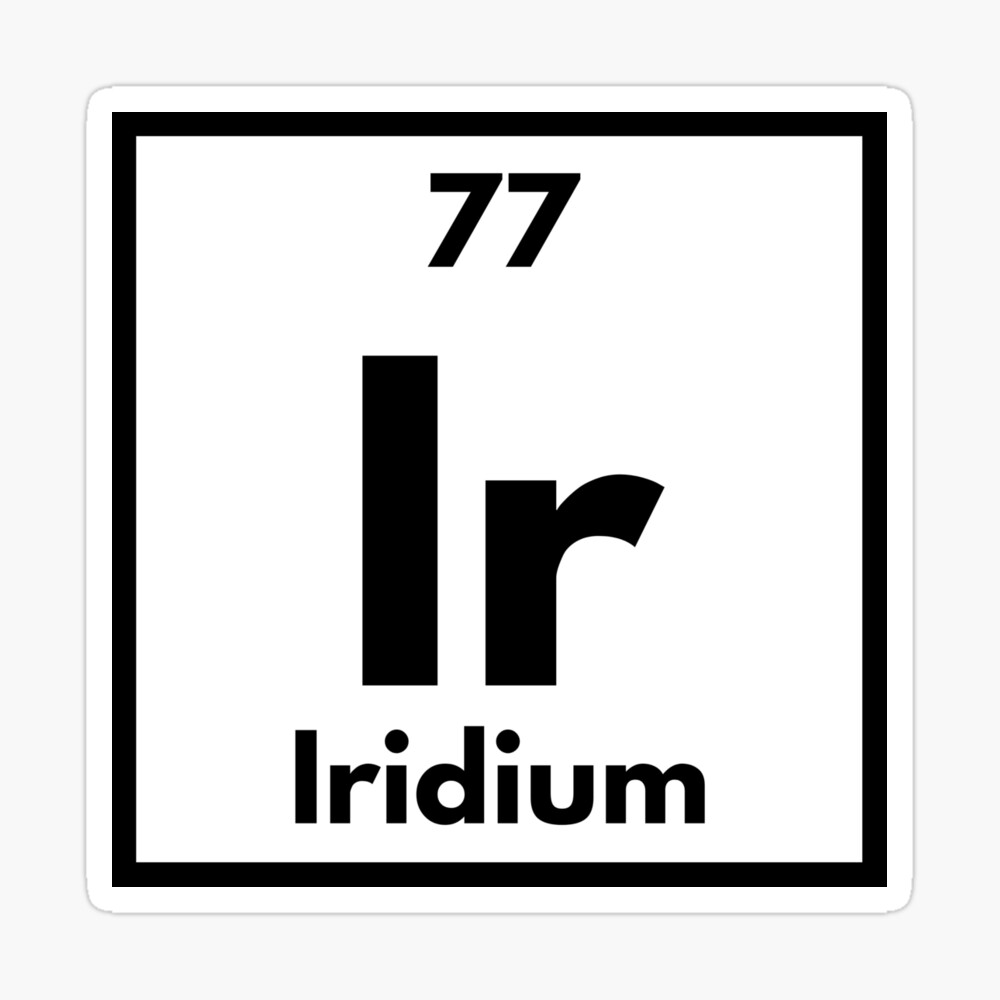

# Iridium

---

Iridium is a free and open-source optimization mod for Minecraft that replaces the game's OpenGL renderer with an implementation which uses Vulkan, a next-generation graphics and compute API. This is done with the end goal being increased frame rates and overall better rendering performance.

⚠️ Iridium is in active development and stability is not guaranteed. This can range from bugs and stability issues to Minecraft crashing. Additionally, due to the use of Vulkan, all mods that make direct calls to OpenGL instead of using Minecraft's wrapper classes/functions are incompatible with Iridium. Therefore, they cannot be installed and used alongside it. While Iridium does try to maintain compatability, complete compatability that works with **no issues** isn't guaranteed.

---

## 🔽 Installation

As of currently, no builds of Iridium are being released anywhere. Check back when Iridium has been released.

---

## 🐛 Reporting Issues

You can report any bugs or issues you come across using the [issue tracker](https://github.com/Ayydxn/Iridium/issues). Before opening a new issue, please use the search tool to make sure your issue hasn't already been reported. Issues that are duplicates of one another or do not contain the necessary information needed to debug them may be closed.

Please note that while the issue tracker is open to feature requests, development is and will be primarily focused on hardware compatibility, performance, completing unfinished features, fixing bugs, etc.

---

## 🛠 Building From Sources

Like most Minecraft mods, Iridium uses the standard Gradle project structure and can be compiled by simply running the default `build` task. After running the task, the build artifacts for each mod loader can be found in that respective mod loader's `build/libs` directory For example, for Fabric, `fabric/build/libs`.

### 📃 Requirements

- **Java 17 JDK**
  - I recommend using the [Azul Zulu](https://www.azul.com) distribution as it is what is used to build Iridium. However, this isn't strictly required. You should be able to use whichever JDK distribution you want without issues.

---

## 🤝 Credits

Thanks to the following mods, Iridium wouldn't be possible as certain parts of its code are derived from these mods. So all credits go to these mods and their original creators. Thank you!❤️

* [VulkanMod](https://modrinth.com/mod/vulkanmod) by [xCollateral](https://github.com/xCollateral) - Iridium aims to be a full-fledged rewrite of VulkanMod, and as such, almost all of Iridium's code comes from it.

* [Sodium](https://modrinth.com/mod/sodium) by [jellysquid3](https://modrinth.com/user/jellysquid3) - A few of Iridium's graphics settings such as the leaves and weather quality are implemented via mixins that came from Sodium.

* [Sodium Extra](https://modrinth.com/mod/sodium-extra) by [FlashyReese](https://github.com/FlashyReese) - The implementation for Iridium's FPS and coordinates overlay came from Sodium Extra.

---

## 📃 License

Iridium is licensed under the free and open-source license, GNU LGPLv3. For more information, please read the [license](https://choosealicense.com/licenses/lgpl-3.0/).