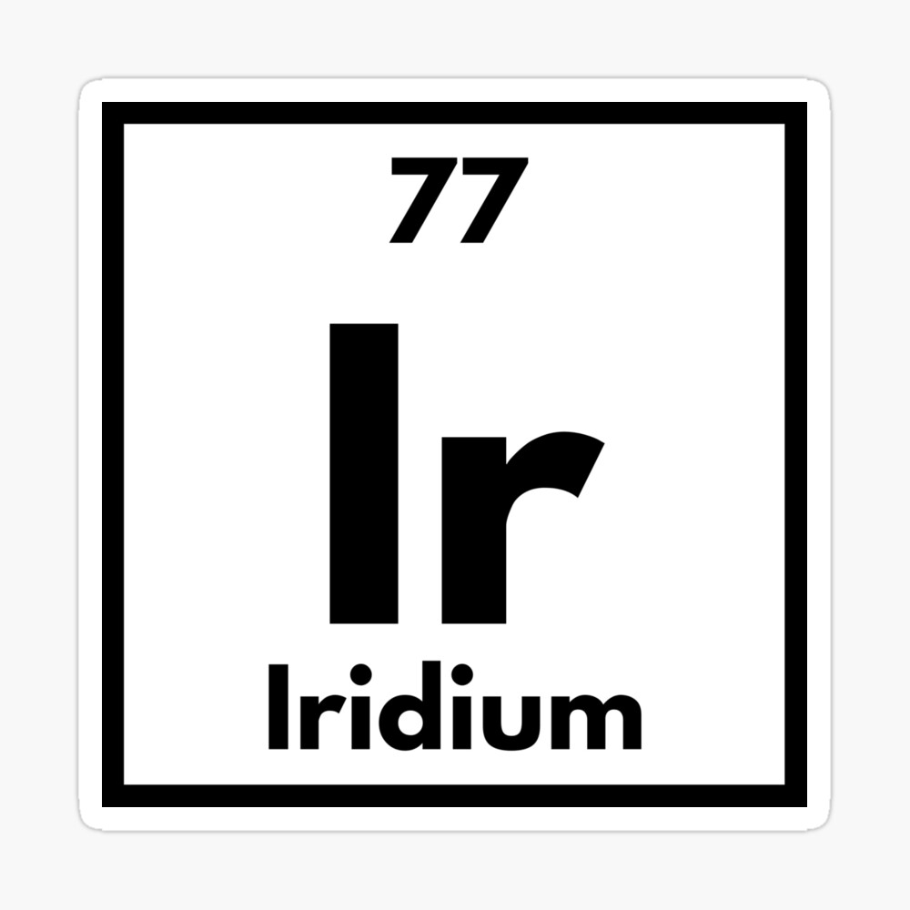

# Iridium

---

Iridium is a free and open-source high-performance rendering engine for Minecraft that replaces the game's OpenGL renderer with a native implementation built on [NVRHI](https://github.com/NVIDIA-RTX/NVRHI) using its DirectX 11/12 backends. The result is a Clustered Forward Renderer with bindless resource management, designed to push frame rates and rendering throughput well beyond what the vanilla renderer can achieve.

⚠️ Iridium is in active development and stability is not guaranteed. This can range from bugs and stability issues to Minecraft crashing. Because Iridium bypasses Minecraft's OpenGL layer entirely, mods that make direct calls to OpenGL instead of going through Minecraft's wrapper classes are incompatible. Complete compatibility with all mods is not guaranteed.

---

## 🔽 Installation

As of currently, no builds of Iridium are being released anywhere. Check back when Iridium has been released.

---

## 🐛 Reporting Issues

You can report any bugs or issues you come across using the [issue tracker](https://github.com/Ayydxn/Iridium/issues). Before opening a new issue, please use the search tool to make sure your issue hasn't already been reported. Issues that are duplicates of one another or do not contain the necessary information needed to debug them may be closed.

Please note that while the issue tracker is open to feature requests, development is and will be primarily focused on hardware compatibility, performance, completing unfinished features, fixing bugs, etc.

---

## 🛠 Building From Sources

Like most Minecraft mods, Iridium uses the standard Gradle project structure and can be compiled by simply running the default `build` task. After running the task, the build artifacts for each mod loader can be found in that respective mod loader's `build/libs` directory For example, for Fabric, `fabric/build/libs`.

### 📃 Requirements

- **Java 17 JDK**
    - I recommend using the [Azul Zulu](https://www.azul.com) distribution as it is what is used to build Iridium. However, this isn't strictly required. You should be able to use whichever JDK distribution you want without issues.

---

## 📃 License

Iridium is licensed under the free and open-source license, GNU LGPLv3. For more information, please read the [license](https://choosealicense.com/licenses/lgpl-3.0/).